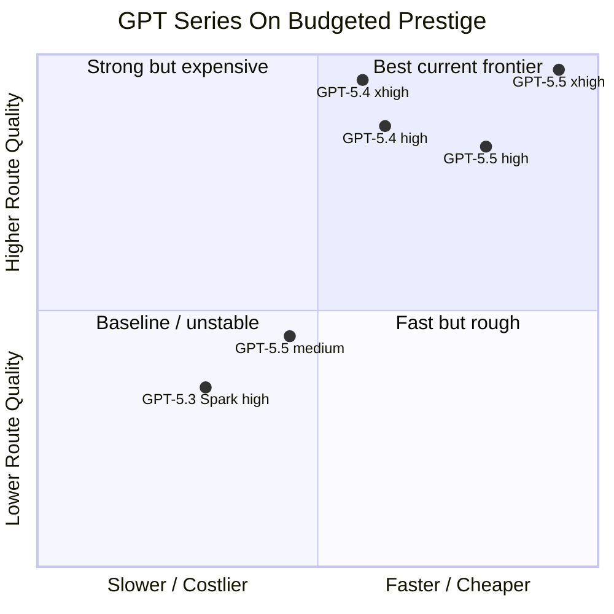
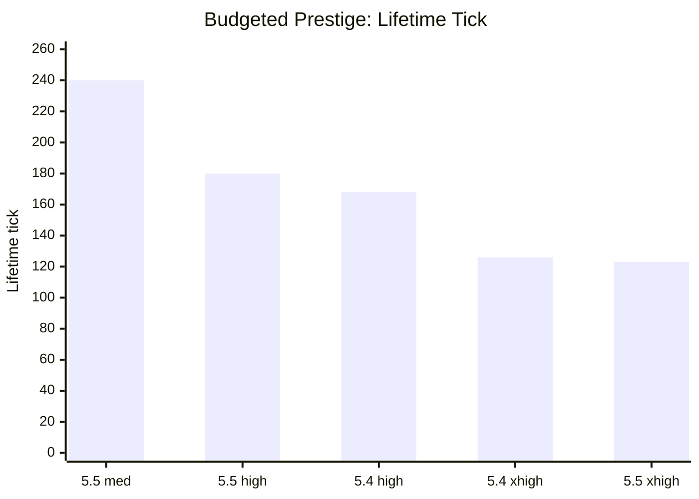
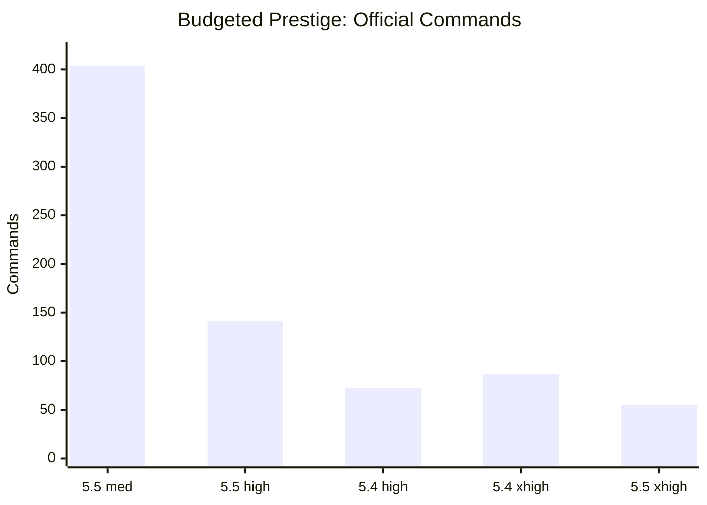
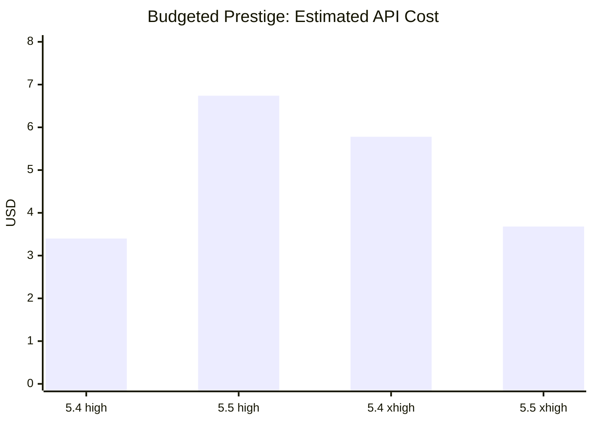

# GPT Series Comparison

Date: `2026-04-27`

Scope: Arcane Lab Codex CLI results, with `budgeted-prestige` as the main comparable track. Some entries are headline baselines from full/selected matrices, so treat this as an evaluation map rather than a formal leaderboard. API cost estimates use official OpenAI API pricing checked on `2026-04-27`.

## Executive Map

## Route Efficiency

Lower is better. `commands` means accepted official server commands for comparable `budgeted-prestige` reruns when available.

## Headline Table

| Model / effort | Outcome | Lifetime tick | Commands | Failed commands | Wall clock | Input tokens | Est. API cost | Helper behavior | Read |
| --- | --- | ---: | ---: | ---: | ---: | ---: | ---: | --- | --- |
| `gpt-5.5 xhigh` | success `7/7` | `123` | `55` | `0` | `613s` | `4.03M` | `$3.68` | bounded route harness | Best current route and quality/cost balance |
| `gpt-5.4 xhigh` | success `7/7` | `126` | `87` | `0` | `1933s` | `10.15M` | `$5.78` | research-heavy route harness | Best route research, expensive |
| `gpt-5.4 high` | success `7/7` | `168` | `72` | `3` | `1488s` | `6.23M` | `$3.40` | phased route harness | Cheapest successful rerun, lower route quality |
| `gpt-5.5 high` | success `7/7` | `180` | `141` | `8` | `650s` | `8.21M` | `$6.74` | route harness | Fast, but less tick/command efficient |
| `gpt-5.5 medium` | unstable / partial | `240` best partial, `241` failed rerun | `404` in failed rerun | `178` in failed rerun | mixed | mixed | `$3.20` / `$1.62` partials | tends toward adaptive autoplayer | Main instability case |
| `gpt-5.3-codex-spark high` | mostly partial baseline | `248` on budgeted-prestige baseline | n/a | n/a | `267s` | `3.63M` | n/a exact | simpler attempts | Useful floor, not prestige-success baseline |

## API Cost Estimate

Successful reruns only, using the standard short-context API price tier.

Formula: `(input_tokens - cached_input_tokens) * input_rate + cached_input_tokens * cached_input_rate + output_tokens * output_rate`, with rates per 1M tokens. `reasoning_output_tokens` is treated as a detail of `output_tokens`, not an extra billable bucket.

| Model / effort | Outcome | Uncached input | Cached input | Output | Standard short est. | Long-context est. |
| --- | --- | ---: | ---: | ---: | ---: | ---: |
| `gpt-5.5 medium` initial partial | partial, best medium attempt | `0.130M` | `3.765M` | `0.022M` | `$3.20` | `$6.07` |
| `gpt-5.5 medium` failed rerun | partial / soft-stop exceeded | `0.079M` | `1.529M` | `0.015M` | `$1.62` | `$3.01` |
| `gpt-5.4 high` | success `7/7` | `0.461M` | `5.766M` | `0.054M` | `$3.40` | `$6.40` |
| `gpt-5.5 high` | success `7/7` | `0.416M` | `7.794M` | `0.025M` | `$6.74` | `$13.10` |
| `gpt-5.4 xhigh` | success `7/7` | `0.908M` | `9.245M` | `0.080M` | `$5.78` | `$10.95` |
| `gpt-5.5 xhigh` | success `7/7` | `0.206M` | `3.823M` | `0.025M` | `$3.68` | `$7.00` |

Notes:

- OpenAI lists standard short-context prices per 1M tokens as `gpt-5.5`: `$5.00` input, `$0.50` cached input, `$30.00` output; and `gpt-5.4`: `$2.50` input, `$0.25` cached input, `$15.00` output. Long-context estimates use the corresponding long-context rates from the same pricing table.
- Runner summaries do not expose whether every individual request stayed in the short-context tier, so the short-context column is the main comparable estimate and the long-context column is a context-sensitive upper scenario.
- These are API-rate estimates, not Codex CLI subscription accounting.
- `gpt-5.3-codex-spark` is not scored for exact API cost because the current pricing page lists `gpt-5.3-codex`, not the exact `gpt-5.3-codex-spark` SKU. If proxied with the listed `gpt-5.3-codex` standard rates, the observed partial run would be about `$1.59`, but that proxy is not used in the score.

## Dimension Scores

Scale: `5` is best for this workload. These are qualitative scores from observed behavior, not a universal model ranking. `Speed/cost` blends wall clock with the API-cost estimate; it is not a pure dollar ranking.

| Model / effort | Goal reliability | Route efficiency | Official discipline | Helper quality | Speed/cost | Stability |
| --- | ---: | ---: | ---: | ---: | ---: | ---: |
| `gpt-5.5 xhigh` | 5 | 5 | 5 | 5 | 5 | 5 |
| `gpt-5.4 xhigh` | 5 | 5 | 5 | 5 | 2 | 5 |
| `gpt-5.4 high` | 5 | 4 | 5 | 4 | 3 | 5 |
| `gpt-5.5 high` | 5 | 3 | 4 | 4 | 4 | 4 |
| `gpt-5.5 medium` | 2 | 2 | 2 | 2 | 3 | 2 |
| `gpt-5.3-codex-spark high` | 2 | 2 | 3 | 2 | 4 | 3 |

## Main Takeaways

- `gpt-5.5 xhigh` is the current best choice for `budgeted-prestige`: shortest official route (`123` lifetime ticks), fewest official commands (`55`), zero failed commands, and lower wall-clock/API-cost estimate than `5.4 xhigh`.
- `gpt-5.4 xhigh` is valuable as a route-research model: it explains and probes mechanics deeply, but costs much more time and tokens.
- `gpt-5.4 high` remains the best conservative baseline: stable, successful, less prone to overbuilding, and the cheapest successful rerun by estimated API cost.
- `gpt-5.5 high` is fast and successful, but its official route was command-heavy and less tick-efficient.
- `gpt-5.5 medium` is the cautionary point: helper use itself is not bad, but this setting tends to drift into broad adaptive/autoplayer scripts that can hang or burn budget.
- `gpt-5.3-codex-spark high` is useful as a lower baseline and prompt sanity check, not as a prestige success baseline.

## Recommended Use

- Default comparison anchor: `gpt-5.4 high`.
- Frontier quality check: `gpt-5.5 xhigh`.
- Route-discovery stress test: `gpt-5.4 xhigh`.
- Cost-conscious success baseline: `gpt-5.4 high`.
- Avoid using `gpt-5.5 medium` alone for conclusions on this track unless rerun count is increased and helper behavior is classified.
